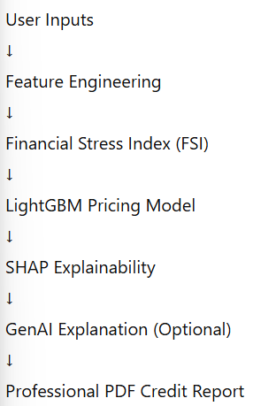

# 🚀 AI Financial Stress Index & Dynamic Credit Pricing System

# 🚀 Project Showcase

🔗 **Live App:** [risk-pulse.streamlit.app](https://risk-pulse.streamlit.app)  
🔗 **GitHub:** [github.com/anuragkumarsingh4440](https://github.com/anuragkumarsingh4440)  
🔗 **LinkedIn:** [linkedin.com/in/anurag-kumar-singh4440](https://www.linkedin.com/in/anurag-kumar-singh4440)  
🔗 **Demo Video (LinkedIn):** [linkedin.com/in/anurag-kumar-singh4440](https://www.linkedin.com/posts/anurag-kumar-singh4440_fintech-explainableai-creditrisk-activity-7417163140762742784-YKLC?utm_source=share&utm_medium=member_desktop&rcm=ACoAAD2NwdkBVynk1_PhoRha6EEqB01AQC-0U50)

---

## 🔴 Core Motivation (Real Banking Insight)

> **On paper, a loan may look safe — but the customer’s financial stress often tells a very different story.**

Traditional credit systems approve or price loans mainly using eligibility rules and static ratios.  
This ignores **hidden financial stress**, which later leads to defaults, customer dissatisfaction, and regulatory risk.

**My goal with this project was clear:**

> Before giving a loan, a bank should verify not just eligibility — but the *actual financial stress level* of the customer.

This system operationalizes that idea.

---

## 🚨 Problem Statement

In most banks and fintech platforms:

- Interest rates are increased **without explanation**
- Customers only see:
  - Higher EMI
  - Higher interest
  - Approval / rejection
- No visibility into:
  - *Which factor increased risk*
  - *What can be improved*
  - *Why the decision was made*

At the same time, risk teams depend on:
- Black-box ML models
- Hard-to-justify decisions
- Limited transparency

👉 This project bridges the gap between **credit risk models and human understanding**.

---
## 📐 Model Performance & Evaluation (Industry Context)

Unlike academic problems, **credit pricing is not a pure prediction task**.  
In banking and fintech, **model stability, directionality, and explainability** matter more than chasing very high R².

### 🔢 Model Metrics

| Dataset | R² Score | RMSE | MAE | Interpretation |
|-------|----------|------|-----|----------------|
| Train | ~0.38 | Low | Low | Stable fit without overfitting |
| Validation | ~0.35 | Low | Low | Consistent generalization |

---

### ❓ Why R² Is Intentionally Not Very High

In real-world **fintech and banking systems**:

- Interest rate is influenced by **policy rules**, not only data
- Human overrides and regulatory caps exist
- Customer behavior is **noisy and non-deterministic**
- Over-optimizing R² leads to **unstable and risky models**

> **A very high R² in credit risk is often a red flag**, not a success.

Banks prefer models that are:
- Stable across time
- Robust to distribution shifts
- Easy to explain to regulators
- Safe under stress scenarios

This is why **industry-grade credit models often have moderate R² but high trust**.

---

### ✅ What This Model Optimizes For

- Directional correctness (risk ↑ → rate ↑)
- Feature-level explainability (via SHAP)
- Consistency between train & validation
- Regulatory-safe behavior
- Long-term deployment stability

> This aligns with how **actual fintech and bank credit pricing models are evaluated**, not with Kaggle-style leaderboards.

## ✅ What This System Does

> An end-to-end explainable AI system that evaluates financial stress, predicts loan interest rate, and explains the decision clearly to both banks and customers.

---

## 🧠 End-to-End System Flow

This mirrors **real fintech credit decision pipelines**.

---

## 🧩 Key Innovation: Financial Stress Index (FSI)

Instead of relying only on raw features, I designed a **Financial Stress Index** inspired by real banking risk frameworks.

### 📉 FSI Interpretation

| FSI Range | Meaning |
|---------|--------|
| **< 0.35** | Low Stress 🟢 |
| **0.35 – 0.65** | Medium Stress 🟡 |
| **> 0.65** | High Stress 🔴 |

### FSI Captures:
- Credit utilization pressure  
- Debt burden (DTI)  
- Payment behavior  
- Recent borrowing stress  

FSI becomes a **single interpretable risk signal** used across the system.

---

## 📊 Dataset Scale & Engineering Reality
# Dataset Notice

This project uses multi-GB real-world credit data.

Due to size and confidentiality, datasets are not included in GitHub.

The data structure is preserved for reproducibility.

| Aspect | Details |
|------|--------|
| Size | **~4 million rows** |
| Domain | Consumer lending |
| Scale | Comparable to fintech & bank datasets |
| Challenge | Memory, leakage, skew, stability |

### Key Challenges Solved
- Memory-efficient processing
- Feature explosion control
- Leakage-safe validation
- Statistically stable features
- Production-friendly modeling

This was **engineering**, not just modeling.

---

## 🛠 Feature Engineering (Business-Driven)

| Feature | Why It Matters |
|------|---------------|
| loan_income_ratio | Exposure vs earning capacity |
| dti × utilization | Compound stress effect |
| stress_intensity | Amplifies real risk |
| loan term | Long-term exposure |

Every feature exists for a **risk or business reason**, not experimentation.

---

## 🤖 Modeling Approach

### Models Explored
| Model | Purpose |
|-----|--------|
| Linear Regression | Baseline |
| Extra Trees | Non-linear check |
| XGBoost | High capacity |
| **LightGBM** | ✅ Final model |

### Why LightGBM?
- Industry-standard in fintech
- Handles large data efficiently
- Strong bias-variance balance
- Native SHAP support

---

## 🔍 Explainability with SHAP

The system visually explains:
- Which factors **increase interest**
- Which factors **reduce interest**
- Direction + magnitude of impact

Only **business-interpretable signals** are shown — no raw ML noise.

---

## 🤖 GenAI Credit Advisor (Optional Layer)

Using **Gemini (gemini-2.5-flash-lite)**, the system converts ML outputs into:

- 🏦 **Bank / Risk Team View**
- 👤 **Customer View**

### Design Principles
- Never contradict the ML decision
- Simple, short bullet points
- Decision-aligned explanations
- Optional (API-safe, cost-controlled)

> GenAI assists communication — **it never replaces the model**.

---

## 🔁 What-If Simulation

Users can simulate:
- Reduced credit utilization
- Improved stress score
- Lower interest rate

This encourages **healthier financial behavior**, a key fintech product insight.

---

## 📄 Professional PDF Credit Report

The downloadable report includes:
- Credit risk summary
- Pricing decision
- Input explanation
- AI advisory (bank + customer)
- Clean, internal-memo-style formatting

This mirrors **how real banks document credit decisions**.

---

## 🚀 Deployment Stack

| Layer | Technology |
|----|------------|
| Frontend | Streamlit |
| Model | LightGBM |
| Explainability | SHAP |
| GenAI | Gemini |
| Reporting | FPDF |
| Hosting | Streamlit Cloud |

Prompting was used to **bootstrap code**, then **manually hardened** into a production-safe app.

---

## 🎯 Biggest Benefit

> **Clear understanding of why a loan is priced a certain way and exactly what can be improved.**

This system connects:
- Data Science  
- Risk Modeling  
- Explainable AI  
- Product Thinking  

---

## ⚠️ Limitation

- Decision-support system only  
- Final approval always depends on bank policy  

(Exactly how real banking systems operate.)

---

## 🧑‍💻 Author

**Anurag Kumar Singh**  
Data Scientist | AI/ML Engineer  

Specialized in:
- FinTech risk modeling
- Explainable AI
- Large-scale data systems
- Production-ready ML products

---

## ⭐ Final Note

This project is not about accuracy alone.

It is about:
- Trust
- Transparency
- Responsible AI
- Real-world deployment thinking

It reflects how modern credit risk systems are actually designed and used.
